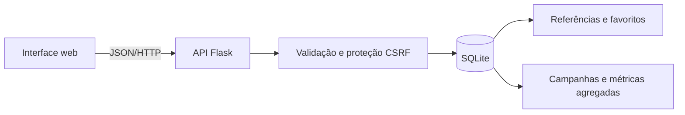

# NutriPedia

Aplicação web de demonstração para organizar referências clínicas sobre alimentação complementar e simular campanhas dirigidas a profissionais de saúde.

O projeto explora duas perspetivas do mesmo produto:

- **Área médica:** guia por idade, biblioteca pesquisável, filtros, favoritos e referências públicas.
- **Área de campanhas:** criação de campanhas HCP, seleção de audiência e canal, gestão de estado e métricas agregadas fictícias.

Todos os patrocinadores, campanhas e resultados apresentados são fictícios. A aplicação não contém dados pessoais de médicos ou pacientes.

## Funcionalidades

### Área médica

- Guia interativo para as etapas 6–8, 9–11 e 12–23 meses.
- Pesquisa sem distinguir maiúsculas ou acentos.
- Filtros por tema e vista de favoritos.
- Criação e edição de referências com validação no navegador e no servidor, apenas para fontes HTTPS da OMS, DGS ou EFSA.
- Persistência local em SQLite.
- Conteúdo patrocinado claramente identificado e separado das referências clínicas.

### Área de campanhas

- Criação de campanhas em estado de rascunho.
- Audiência e canal configuráveis.
- Estados `draft`, `active` e `paused`.
- Cálculo de alcance, taxa de abertura e taxa de clique a partir de dados agregados.
- Dados de demonstração sem identificação individual.

## Tecnologias

- Python 3 e Flask
- SQLite
- HTML semântico, CSS responsivo e JavaScript
- `unittest` para testes de comportamento



## Executar localmente

Requer Python 3.10 ou superior.

```sh
git clone URL_DO_REPOSITORIO
cd nutripedia
python3 -m venv .venv
source .venv/bin/activate
python -m pip install -r requirements.txt
python app.py
```

No Windows, ativa o ambiente com `.venv\Scripts\activate`.

Abre [http://127.0.0.1:5050](http://127.0.0.1:5050). A base de dados é criada automaticamente com oito referências e duas campanhas demonstrativas.

Para uma chave de sessão estável, define `SECRET_KEY` no ambiente. Consulta [.env.example](.env.example).

## Testes

```sh
python -m unittest -v
```

Os sete testes utilizam bases de dados temporárias e cobrem:

- pesquisa combinada com filtros e normalização de acentos;
- criação, edição e persistência de referências;
- adição e remoção de favoritos;
- validação de campos, ligações e proteção CSRF;
- criação de campanhas, métricas iniciais e alteração de estado.

## Endpoints principais

| Método | Endpoint | Função |
|---|---|---|
| `GET` | `/api/resources` | Pesquisar e filtrar referências |
| `POST` | `/api/resources` | Criar uma referência |
| `PUT` | `/api/resources/:id` | Editar uma referência |
| `PATCH` | `/api/resources/:id/favorite` | Alterar um favorito |
| `GET` | `/api/campaigns` | Consultar campanhas e métricas agregadas |
| `POST` | `/api/campaigns` | Criar uma campanha |
| `PATCH` | `/api/campaigns/:id/status` | Alterar o estado de uma campanha |

## Estrutura

```text
nutripedia/
├── app.py
├── requirements.txt
├── test_app.py
├── templates/
│   ├── index.html
│   └── campaigns.html
└── static/
    ├── app.js
    ├── campaigns.js
    ├── style.css
    ├── campaigns.css
    └── favicon.svg
```

## Decisões técnicas

- **SQLite** mantém a demonstração simples e reproduzível, sem um servidor de base de dados externo.
- **SQL parametrizado** separa os valores das instruções e reduz o risco de injeção SQL.
- **Validação no servidor** protege a API mesmo quando a validação do formulário é contornada.
- **Lista de domínios de confiança** impede a introdução de fontes não verificadas na biblioteca.
- **Proteção CSRF** é obrigatória nos pedidos que alteram dados.
- **`textContent` no JavaScript** evita inserir conteúdo recebido como HTML.
- **Métricas agregadas** demonstram análise de campanhas sem perfis individuais.
- **JavaScript sem framework** mantém o fluxo completo acessível para estudo e explicação numa entrevista júnior.

## Limitações e evolução

A versão atual é local e de utilizador único. Não inclui contas, autorização por função ou infraestrutura de produção. Antes de uma disponibilização pública com escrita persistente seriam necessários autenticação, autorização, HTTPS, uma chave de sessão gerida de forma segura e um servidor de produção.

Uma evolução natural seria separar a camada de dados, adicionar utilizadores com funções distintas, guardar consentimento para comunicações patrocinadas e criar uma pista de auditoria para alterações de campanhas.

As referências apontam para fontes públicas e não constituem aconselhamento clínico. O desenvolvimento foi feito com assistência de IA, seguido de revisão funcional e testes automatizados; quem apresenta o projeto deve compreender e conseguir explicar as decisões implementadas.
